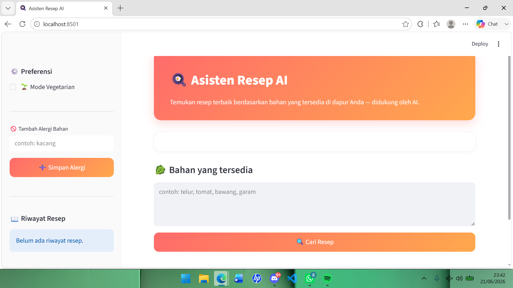
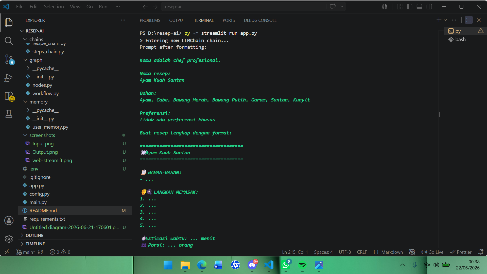

# 🍳 Asisten Resep AI

Aplikasi asisten memasak berbasis AI yang membantu pengguna menemukan resep
berdasarkan bahan yang tersedia di dapur, dibangun menggunakan LangChain,
LangGraph, dan LangSmith.

---

## 📌 Deskripsi

Asisten Resep AI adalah aplikasi conversational yang memproses input bahan makanan
dari pengguna, lalu secara otomatis mengekstrak bahan, mempertimbangkan preferensi
pengguna, mencari 3 rekomendasi resep, dan menghasilkan langkah memasak lengkap —
semuanya dijalankan melalui pipeline LangGraph yang terstruktur dan dipantau penuh
lewat LangSmith.

Tersedia dalam dua bentuk antarmuka: **web (Streamlit)** dan **CLI (terminal)**.

---

## ✨ Fitur Utama

- **Ekstraksi bahan otomatis** — cukup ketik bahan dalam kalimat bebas (misal "saya punya telur, tomat, sama bawang"), sistem otomatis mengenali daftar bahannya.
- **Rekomendasi 3 resep sekaligus** — setiap pencarian menghasilkan satu resep utama lengkap dengan langkah memasak, plus 2 alternatif lain yang bisa dipilih.
- **Preferensi pengguna (memory)** — mode vegetarian dan daftar alergi tersimpan selama sesi berjalan dan otomatis dipertimbangkan di setiap rekomendasi berikutnya.
- **Riwayat percakapan** — semua interaksi tersimpan di memory dan bisa dilihat kembali kapan saja.
- **Dua antarmuka pengguna** — versi web interaktif (Streamlit) untuk pengalaman visual, dan versi CLI untuk eksekusi cepat lewat terminal.
- **Pipeline terstruktur (LangGraph)** — proses dipecah menjadi 4 node yang berjalan berurutan dan dapat dilacak secara independen.
- **Tracing penuh (LangSmith)** — setiap input, output, durasi, dan token dari tiap node otomatis tercatat untuk keperluan debugging dan evaluasi.

---

## 🧠 Arsitektur

Pipeline LangGraph terdiri dari 4 node berurutan:
User Input

│

▼

[Node 1] ekstrak_bahan       → Ekstrak bahan makanan dari teks bebas

│

▼

[Node 2] cek_preferensi      → Ambil preferensi pengguna dari memory

│

▼

[Node 3] cari_resep          → Generate 3 rekomendasi resep (JSON)

│

▼

[Node 4] generate_langkah    → Buat langkah memasak lengkap

│

▼

Output

## 🗂️ Struktur Proyek
resep-ai/

├── chains/

│   ├── extract_chain.py       # Chain ekstraksi bahan makanan

│   ├── recipe_chain.py        # Chain pencarian 3 resep

│   └── steps_chain.py         # Chain pembuatan langkah memasak

├── graph/

│   ├── nodes.py               # Definisi semua node LangGraph

│   └── workflow.py            # Kompilasi graph LangGraph

├── memory/

│   └── user_memory.py         # Manajemen preferensi & riwayat percakapan

├── app.py                     # Antarmuka web Streamlit

├── main.py                    # Antarmuka CLI interaktif

├── config.py                  # Konfigurasi API key & LangSmith

├── requirements.txt           # Dependensi Python

└── .env                       # API key (tidak di-commit ke Git)

---

## ⚙️ Teknologi yang Digunakan

| Teknologi | Fungsi |
|---|---|
| LangChain | Membangun chain prompt + LLM |
| LangGraph | Mengatur alur pipeline sebagai graph |
| LangSmith | Tracing dan monitoring eksekusi |
| Groq API | LLM backend (`llama-3.3-70b-versatile`) |
| Streamlit | Antarmuka web interaktif |
| python-dotenv | Manajemen environment variable |

---

## 🚀 Cara Menjalankan

### 1. Clone repository

```bash
git clone https://github.com/username/resep-ai.git
cd resep-ai
```

### 2. Buat virtual environment

```bash
python -m venv venv

# Windows
venv\Scripts\activate

# Mac/Linux
source venv/bin/activate
```

### 3. Install dependensi

```bash
pip install -r requirements.txt
```

### 4. Buat file `.env`

Buat file `.env` di root proyek dengan isi berikut:

```env
GROQ_API_KEY=your_groq_api_key_here
LANGCHAIN_API_KEY=your_langsmith_api_key_here
```

> Dapatkan `GROQ_API_KEY` di: https://console.groq.com
> Dapatkan `LANGCHAIN_API_KEY` di: https://smith.langchain.com

### 5. Jalankan aplikasi

Pilih salah satu sesuai kebutuhan:

**🌐 Antarmuka web (Streamlit) — direkomendasikan**

```bash
streamlit run app.py


```

Lalu buka browser ke alamat yang muncul di terminal (biasanya `http://localhost:8501`).


**💻 Antarmuka CLI (terminal)**

```bash
python main.py
```

---

## 💬 Cara Penggunaan

### Web (Streamlit)

1. Buka browser ke `http://localhost:8501`
2. Centang preferensi (vegetarian, alergi) di sidebar
3. Masukkan bahan yang tersedia di kolom input
4. Klik tombol **🔍 Cari Resep**
5. Lihat resep utama beserta alternatifnya

### CLI

Setelah menjalankan `python main.py`, tersedia perintah berikut:

| Perintah | Fungsi |
|---|---|
| `telur, tomat, garam` | Cari resep berdasarkan bahan |
| `vegetarian` | Aktifkan mode vegetarian |
| `alergi kacang` | Tambahkan alergi bahan |
| `riwayat` | Lihat riwayat percakapan |
| `preferensi` | Lihat preferensi tersimpan |
| `keluar` | Keluar dari program |

---

## 🖼️ Screenshot

> Ganti placeholder di bawah dengan screenshot asli aplikasi kamu sebelum upload ke GitHub.

**Antarmuka Web (Streamlit)**




**Antarmuka CLI**



**Dashboard LangSmith (Tracing)**


---


## 🔍 Monitoring dengan LangSmith

Setiap eksekusi graph otomatis di-trace ke LangSmith. Untuk melihat hasilnya:

1. Login ke https://smith.langchain.com
2. Buka project **`resep-ai-uas`**
3. Lihat trace setiap node: `ekstrak_bahan`, `cek_preferensi`, `cari_resep`, `generate_langkah`

---

## 🛠️ Troubleshooting

| Masalah | Solusi |
|---|---|
| `ModuleNotFoundError` saat run | Pastikan virtual environment aktif, lalu jalankan ulang `pip install -r requirements.txt` |
| Resep tidak muncul / error JSON | Coba ulang dengan bahan yang lebih spesifik; model kadang menghasilkan format yang tidak konsisten |
| Trace tidak muncul di LangSmith | Pastikan `LANGCHAIN_API_KEY` di `.env` sudah benar dan `LANGCHAIN_TRACING_V2=true` di `config.py` |
| `streamlit: command not found` | Pastikan virtual environment aktif dan Streamlit sudah terinstall (`pip show streamlit`) |

---

## 📦 Requirements
langchain

langchain-classic

langgraph

langsmith

python-dotenv

groq

streamlit

---

## 👤 Identitas Mahasiswa

| | |
|---|---|
| **Nama** | M. Fadhel Khairi Jujur |
| **NPM** | 233510658 |
| **Mata Kuliah** | Pemrosesan Bahasa Alami  |
| **Universitas** | Universitas Islam Riau |

---

## 📄 Lisensi

Proyek ini dibuat untuk keperluan tugas akhir semester (UAS).